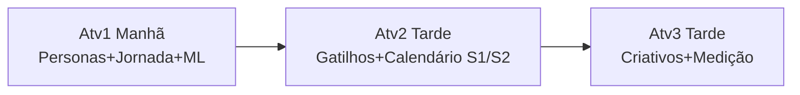
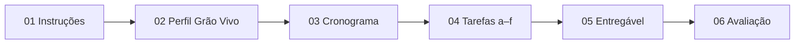

# 00 — Visão Geral da Atividade

> [!QUOTE] Fonte literal — `Atividade_1_Aluno_Persona_e_Experiencia_do_Cliente.docx:1-14`
> - `SERVIÇO NACIONAL DE APRENDIZAGEM INDUSTRIAL – SENAI-SP`
> - `APERFEIÇOAMENTO PROFISSIONAL – MARKETING DIGITAL COM INTELIGÊNCIA ARTIFICIAL`
> - `ATIVIDADE 1 – DA PERSONA À EXPERIÊNCIA DO CLIENTE`
> - `Persona, neuromarketing e mensuração de resultados com apoio de Inteligência Artificial`

## 🪪 Identificação

| Campo | Valor literal |
|---|---|
| **Autor** | `Gabriel Guimarães Carneiro` |
| **Função** | `Instrutor – SENAI-SP` |
| **Local** | `Registro – SP` |
| **Ano** | `2026` |

> [!NOTE] Campos de preenchimento na capa
> `Aluno(a): _______________________________________________` — `Atividade_1_...docx:13`
> `Data: _____ / _____ / 2026` — `Atividade_1_...docx:14`
> Preencha na entrega final (ver [[07-checklist-e-templates]] e `entregaveis/`).

## 📝 Resumo Executivo

> [!QUOTE] Citação literal — `Atividade_1_...docx:11`
> `Este caderno apresenta a Atividade 1 (Manhã, duração de 3h15 (com intervalo de 10h45 às 11h00)) da sessão de encerramento do curso de Aperfeiçoamento Profissional Marketing Digital com Inteligência Artificial, do SENAI-SP. A atividade é individual, segue as estratégias de estudo de caso e situação-problema, e exige o uso de Inteligência Artificial generativa.`

> [!IMPORTANT] Características-chave
> - **Duração:** `3h15` com intervalo `10h45–11h00` (manhã)
> - **Modalidade:** `Individual`
> - **Estratégias:** `estudo de caso` + `situação-problema`
> - **Requisito:** uso obrigatório de `IA generativa` com registro de prompts

## 🔑 Palavras-chave

> [!QUOTE] `Atividade_1_...docx:12`
> `Palavras-chave: Marketing Digital. Inteligência Artificial. Neuromarketing. Persona. Avaliação por capacidades.`

`#marketing-digital` `#inteligencia-artificial` `#neuromarketing` `#persona` `#avaliacao-por-capacidades`

## 🎯 Objetivo Geral

> [!EXAMPLE] Missão da consultoria júnior
> Planejar, com apoio de [[06-guia-ia-e-prompts|IA generativa]], o **lançamento de uma nova linha de cafés especiais (torra média, premium)** da empresa **[[02-perfil-grao-vivo|Grão Vivo]]**, com foco em:
> 1. Criar **2 personas** coerentes com o perfil do cliente
> 2. Mapear a **jornada do cliente** (descoberta → consideração → decisão) para cada persona
> 3. Propor **ferramenta de personalização** (chatbot, assistente virtual ou motor de recomendação) justificada com dados/ML

> [!WARNING] Situação-problema que ancora tudo — `Atividade_1_...docx:28`
> `A Grão Vivo não sabe exatamente quem são os seguidores das redes sociais que ainda não compraram, nem como personalizar a experiência de compra desse público antes do lançamento da nova linha de cafés.`

## 🧩 Onde esta atividade se encaixa no curso

- **Curso:** Aperfeiçoamento Profissional Marketing Digital com IA — SENAI-SP (Plano de curso 2024) — `Atividade_1_...docx:49` + `Atividade_2_...docx:48`
- **Sessão:** Encerramento (8h) — esta é a **Atividade 1 da manhã** (3h15). Ver [[03-cronograma]] para o dia completo. **Continua na Atividade 2 (tarde 14h-16h, 2h) → [[08-visao-geral-atv2|08 — Visão Geral Atv2]]** — o dia simula um único projeto do início ao fim `Atividade_2_...docx:16`.
- **Capacidades mobilizadas:** `CT2, CT4, CSE1, CSE2` → detalhes em [[01-instrucoes-e-capacidades#1.2 Quadro 1 — Capacidades Mobilizadas (cópia fiel)|Quadro 1]]. Atv2 mobiliza `CT1,CT4,CSE2,CSE3` — ver `[[08-visao-geral-atv2]]`.

> [!INFO] Continuidade Atv1 → Atv2
> `Reaproveite as personas e as peças produzidas nas atividades anteriores, pois o dia de hoje simula um único projeto de consultoria, do início ao fim.` — `Atividade_2_...docx:16`. As 2 personas `[[../entregaveis/personas/persona-01-indecisa-curadoria|Ana]]`/`[[../entregaveis/personas/persona-02-comparador-valor|Rafael]]` de Atv1 alimentarão os gatilhos e calendário de Atv2.

## 📑 Estrutura do Caderno Original

1. Instruções Gerais → [[01-instrucoes-e-capacidades]]
2. Situação de Aprendizagem (Grão Vivo) → [[02-perfil-grao-vivo]]
3. Cronograma da Sessão → [[03-cronograma]]
4. Atividade 1 — Da Persona à Experiência
   - 4.1 Situação-problema
   - 4.2 Tarefas (a–f) → [[04-tarefas-passo-a-passo]]
   - 4.3 Uso de IA → [[06-guia-ia-e-prompts]]
   - 4.4 Entregável → [[05-entregavel-e-avaliacao]]
   - 4.5 Critérios de Avaliação → [[05-entregavel-e-avaliacao]]
5. Referências

## 📚 Referências (cópia literal — `Atividade_1_...docx:47-49`)

> [!QUOTE] Referências
> `CARNEIRO, Gabriel Guimarães. Comportamento do consumidor: gatilhos aplicados ao marketing. Registro: SENAI-SP, 2026. Material de apoio da unidade curricular.`
> `GABRIEL, Martha. Marketing na era digital. São Paulo: Atlas, 2020.`
> `SENAI. Departamento Regional de São Paulo. Plano de curso: Aperfeiçoamento Profissional – Marketing Digital com Inteligência Artificial. São Paulo: SENAI-SP, 2024.`
> `YANAZE, Mitsuru Higuchi. Marketing digital. São Paulo: Saraiva, 2022.`

---

> [!SUCCESS] Próximo passo
> Leia [[01-instrucoes-e-capacidades|01 — Instruções e Capacidades]] para entender regras e o que será avaliado.

#visao-geral #senai
