# 03 — Cronograma da Sessão (8h)

> [!QUOTE] Fonte literal — `Atividade_1_Aluno_Persona_e_Experiencia_do_Cliente.docx:21-23` + `TABLE 2`
> `3 CRONOGRAMA DA SESSÃO`

## 3.1 Contexto

> [!QUOTE] `Atividade_1_...docx:22`
> `Esta atividade corresponde ao bloco de manhã, destacado no Quadro 3.`

> [!QUOTE] `Quadro 3 – Cronograma da sessão (8h)` — `Atividade_1_...docx:23`

## 3.2 Quadro 3 — Transcrição Fiel

| Horário | Atividade | Duração | Capacidades |
|---|---|---|---|
| `09h15–09h30` | `Abertura e apresentação da situação de aprendizagem` | `15 min` | `—` |
| `09h30–10h45` | `Atividade 1 – Da Persona à Experiência do Cliente` | `1h15` | `CT2, CT4, CSE1, CSE2` |
| `10h45–11h00` | `Intervalo` | `15 min` | `—` |
| `11h00–13h00` | `Atividade 1 (continuação)` | `2h` | `CT2, CT4, CSE1, CSE2` |
| `13h00–14h00` | `Intervalo para almoço` | `1h` | `—` |
| `14h00–16h00` | `Atividade 2 – Neuromarketing e Calendário de Conteúdo` | `2h` | `CT1, CT4, CSE2, CSE3` |
| `16h00–16h15` | `Intervalo` | `15 min` | `—` |
| `16h15–18h00` | `Atividade 3 – Produção dos Criativos e Medição de Resultados` | `1h45` | `CT3, CT5, CT6, CSE1, CSE3` |
| `18h00–18h15` | `Encerramento, entrega e autoavaliação` | `15 min` | `—` |

> [!NOTE] Fonte
> `TABLE 2` do .docx.

### Destaque — Seu bloco

> [!IMPORTANT] Bloco da manhã — Atividade 1
> `09h30–13h00 (3h15 total, com intervalo 10h45–11h00)` — entrega até o **fim da aula** `Atividade_1_...docx:16`.

```mermaid
gantt
    title Cronograma da Sessão — SENAI 8h
    dateFormat HH:mm
    axisFormat %H:%M
    section Manhã
    Abertura                    :09:15, 15m
    Atividade 1 - Parte 1       :09:30, 75m
    Intervalo                   :10:45, 15m
    Atividade 1 - Parte 2       :11:00, 120m
    section Tarde
    Almoço                      :13:00, 60m
    Atividade 2                 :14:00, 120m
    Intervalo                   :16:00, 15m
    Atividade 3                 :16:15, 105m
    Encerramento                :18:00, 15m
```

## 3.3 Sugestão de Timebox para Atividade 1 (3h15)

> [!TIP] Use o plugin **Tasks** ou **Dataview** para acompanhar

| Bloco | Tarefa | Tempo | Apoio |
|---|---|---|---|
| `09h30–09h45` | (a) Analisar perfil Grão Vivo | `15 min` | [[02-perfil-grao-vivo]] |
| `09h45–10h15` | (b) Escrever prompt + gerar 2 personas na IA | `30 min` | [[06-guia-ia-e-prompts]] + [[templates/persona\|persona]] |
| `10h15–10h45` | (c) Revisar/corrigir personas | `30 min` | [[02-perfil-grao-vivo#2.4 Checklist de Coerência|checklist coerência]] |
| `10h45–11h00` | Intervalo | `15 min` | — |
| `11h00–12h00` | (d) Mapear jornada (2 personas x 3 etapas) | `60 min` | [[templates/jornada-cliente\|jornada]] |
| `12h00–12h40` | (e) Propor ferramenta + justificativa dados/ML | `40 min` | [[templates/proposta-personalizacao\|proposta]] |
| `12h40–13h00` | (f) Registrar prompts + formatar documento | `20 min` | [[templates/registro-prompts\|registro]] + [[05-entregavel-e-avaliacao]] |

### Checklist de tempo (tasks clicáveis no Obsidian)

- [ ] 09h30–09h45 (a) Análise Grão Vivo #tarefa/a
- [ ] 09h45–10h15 (b) Prompt + geração #tarefa/b
- [ ] 10h15–10h45 (c) Revisão crítica #tarefa/c
- [ ] 11h00–12h00 (d) Jornada 3 etapas #tarefa/d
- [ ] 12h00–12h40 (e) Ferramenta + ML #tarefa/e
- [ ] 12h40–13h00 (f) Registro + entrega #tarefa/f

> [!WARNING] Buffer
> Reserve 10 min de buffer para revisão com [[07-checklist-e-templates#Checklist Final|checklist final]] antes de entregar (CSE1 — visão sistêmica).

## 3.4 O que acontece depois (tarde)

| Horário | Atividade | Obs |
|---|---|---|
| `14h00–16h00` | Atividade 2 (Neuromarketing + Calendário) | `CT1, CT4, CSE2, CSE3` |
| `16h15–18h00` | Atividade 3 (Criativos + Medição) | `CT3, CT5, CT6, CSE1, CSE3` |
| `18h00–18h15` | Encerramento e autoavaliação | — |

> [!NOTE] Coerência
> As atividades 2 e 3 consomem o mesmo caso [[02-perfil-grao-vivo|Grão Vivo]] — mantenha personas/jornada coerentes para o dia todo.

---

> [!SUCCESS] Próximo passo
> [[04-tarefas-passo-a-passo|04 — Tarefas Passo a Passo]] para executar cada tarefa com critério.

#cronograma #timebox
