# 03 — Cronograma da Sessão (8h)

> [!QUOTE] Fonte literal — `Atividade_1_Aluno_Persona_e_Experiencia_do_Cliente.docx:21-23` + `Atividade_2_Aluno_Neuromarketing_e_Calendario_de_Conteudo.docx:21-23` + `TABLE 2`

## 3.1 Contexto

> [!QUOTE] Atv1 — `Atividade_1_...docx:22`
> `Esta atividade corresponde ao bloco de manhã, destacado no Quadro 3.`

> [!QUOTE] Atv2 — `Atividade_2_...docx:22` — **novo destaque**
> `Esta atividade corresponde ao bloco de tarde (bloco 1), destacado no Quadro 3.`

> [!QUOTE] `Quadro 3 – Cronograma da sessão (8h)` — `Atividade_1_...docx:23` / `Atividade_2_...docx:23`

## 3.2 Quadro 3 — Transcrição Fiel (comum Atv1+Atv2)

| Horário | Atividade | Duração | Capacidades |
|---|---|---|---|
| `09h15–09h30` | `Abertura e apresentação da situação de aprendizagem` | `15 min` | `—` |
| `09h30–10h45` | `Atividade 1 – Da Persona à Experiência do Cliente` | `1h15` | `CT2, CT4, CSE1, CSE2` |
| `10h45–11h00` | `Intervalo` | `15 min` | `—` |
| `11h00–13h00` | `Atividade 1 (continuação)` | `2h` | `CT2, CT4, CSE1, CSE2` |
| `13h00–14h00` | `Intervalo para almoço` | `1h` | `—` |
| `14h00–16h00` | `Atividade 2 – Neuromarketing e Calendário de Conteúdo` | `2h` | `CT1, CT4, CSE2, CSE3` |
| `16h00–16h15` | `Intervalo` | `15 min` | `—` |
| `16h15–18h00` | `Atividade 3 – Produção dos Criativos e Medição de Resultados` | `1h45` | `CT3, CT5, CT6, CSE1, CSE3` |
| `18h00–18h15` | `Encerramento, entrega e autoavaliação` | `15 min` | `—` |

> [!NOTE] Fonte
> `TABLE 2` dos dois .docx — idêntico. Cores: manhã Atv1, tarde Atv2.

### Destaque — Blocos

> [!IMPORTANT] Bloco da manhã — Atividade 1
> `09h30–13h00 (3h15 total, com intervalo 10h45–11h00)` — `Atividade_1_...docx:26` — entrega até 13h00.

> [!IMPORTANT] Bloco da tarde (bloco 1) — Atividade 2 — **ATUALIZAÇÃO**
> `14h00–16h00 (2h) | Turno: Tarde (bloco 1) | Modalidade: Individual` — `Atividade_2_...docx:26` — entrega até 16h00. Reaproveite personas Atv1!

```mermaid
gantt
    title Cronograma da Sessão — SENAI 8h (Atv1+Atv2)
    dateFormat HH:mm
    axisFormat %H:%M
    section Manhã
    Abertura                    :09:15, 15m
    Atividade 1 - Parte 1       :09:30, 75m
    Intervalo                   :10:45, 15m
    Atividade 1 - Parte 2       :11:00, 120m
    section Tarde
    Almoço                      :13:00, 60m
    Atividade 2 (NOVO)          :14:00, 120m
    Intervalo                   :16:00, 15m
    Atividade 3                 :16:15, 105m
    Encerramento                :18:00, 15m
```

## 3.3 Sugestão de Timebox

### Atividade 1 (3h15) — Manhã 09h30-13h00

| Bloco | Tarefa | Tempo | Apoio |
|---|---|---|---|
| `09h30–09h45` | (a) Analisar perfil Grão Vivo | `15 min` | [[02-perfil-grao-vivo]] |
| `09h45–10h15` | (b) Prompt + 2 personas IA | `30 min` | [[06-guia-ia-e-prompts]] |
| `10h15–10h45` | (c) Revisar personas | `30 min` | [[02-perfil-grao-vivo#2.4 Checklist|checklist]] |
| `10h45–11h00` | Intervalo | `15 min` | — |
| `11h00–12h00` | (d) Jornada 3 etapas | `60 min` | [[templates/jornada-cliente\|jornada]] |
| `12h00–12h40` | (e) Ferramenta + ML | `40 min` | [[templates/proposta-personalizacao\|proposta]] |
| `12h40–13h00` | (f) Registro prompts | `20 min` | [[05-entregavel-e-avaliacao]] |

### Atividade 2 (2h) — Tarde 14h00-16h00 — **NOVO**

| Bloco | Tarefa | Tempo | Apoio |
|---|---|---|---|
| `14h00–14h15` | (a) Retomar S1/S2 + gatilhos | `15 min` | [[08-visao-geral-atv2]] |
| `14h15–14h55` | (b) Selecionar ≥3 gatilhos por persona + funil | `40 min` | [[09-tarefas-gatilhos-funil]] + [[templates/gatilhos-por-persona\|gatilhos]] |
| `14h55–15h45` | (c) Calendário 3 posts (canal+funil+gatilho) | `50 min` | [[10-calendario-conteudo]] + [[templates/calendario-3-posts\|calendario]] |
| `15h45–16h00` | (d)+(e) IA revisa lógica + justificativa S1/S2 | `15 min` | [[11-guia-ia-revisao]] + [[templates/justificativa-s1-s2\|justificativa]] |

> [!TIP] Use Tasks/Dataview
> - [ ] Atv2 (a) S1/S2 #tarefa/a-atv2
> - [ ] Atv2 (b) ≥3 gatilhos #tarefa/b-atv2
> - [ ] Atv2 (c) Calendário 3 posts #tarefa/c-atv2
> - [ ] Atv2 (d) IA revisão #tarefa/d-atv2
> - [ ] Atv2 (e) Justificativa #tarefa/e-atv2

## 3.4 O que acontece depois

| Horário | Atividade | Obs |
|---|---|---|
| `16h15–18h00` | Atividade 3 (Criativos + Medição) | `CT3,CT5,CT6,CSE1,CSE3` |
| `18h00–18h15` | Encerramento e autoavaliação | — |

> [!NOTE] Coerência dia inteiro
> `Reaproveite as personas e as peças` — `Atividade_2_...docx:16` — mantenha `[[../entregaveis/personas/persona-01-indecisa-curadoria|Ana]]` e `[[../entregaveis/personas/persona-02-comparador-valor|Rafael]]` coerentes Atv1→Atv2→Atv3.

---
> [!SUCCESS] Próximos passos
> Atv1: [[04-tarefas-passo-a-passo|04 — Tarefas Atv1]] • Atv2: [[08-visao-geral-atv2|08 — Visão Geral Atv2]]

#cronograma #timebox
