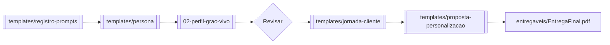

# 07 — Checklist Final e Templates

> [!QUOTE] Fonte consolidada
> Este arquivo consolida [[05-entregavel-e-avaliacao|Entregável e Avaliação]] + [[04-tarefas-passo-a-passo|Tarefas]] + [[02-perfil-grao-vivo|Quadro 2]] em checklist clicável Obsidian. Use antes de exportar para `entregaveis/`.

## 7.1 Checklist Final — Antes de Entregar

> [!IMPORTANT] Critérios Críticos — sem estes, reprova

- [ ] **CC-a** 2 personas com dados coerentes ao [[02-perfil-grao-vivo|Quadro 2]] (28-45, região, 60% nunca comprou) #criterio/critico
- [ ] **CC-b** Jornada nas 3 etapas para cada persona (descoberta/consideração/decisão) #criterio/critico
- [ ] **CC-c** Prompt(s) registrado(s) na íntegra + evidência IA generativa #criterio/critico
- [ ] **CC-d** Proposta de personalização justificada com dados/ML #criterio/critico

> [!TIP] Critérios Desejáveis — diferencial

- [ ] **CD-a** Indicadores para validar personas (ex: conversão, CTR, NPS, pesquisa) #criterio/desejavel
- [ ] **CD-b** Limitações da IA apontadas (viés/generalização) #criterio/desejavel
- [ ] **CD-c** Proposta além do mínimo (quiz + chatbot + e-mail) #criterio/desejavel

> [!WARNING] Revisão CSE1/CSE2

- [ ] Revisei personas com [[02-perfil-grao-vivo#2.4 Checklist de Coerência|Checklist de Coerência Grão Vivo]] #revisao
- [ ] Corrigi alucinações da IA e registrei o que mudei
- [ ] Documento contém capa com `Aluno(a)` e `Data: __/__/2026` — `Atividade_1_...docx:13-14`
- [ ] Exportei Word/PDF/apresentação para `entregaveis/`

## 7.2 Templates — Pasta `templates/`

> [!INFO] Como usar
> No Obsidian, abra o template → `Ctrl+A` → `Ctrl+C` → crie nova nota em `entregaveis/` ou copie direto para seu Word/PDF. Todos têm frontmatter Obsidian.

| Template | Arquivo | Descrição | Tarefa |
|---|---|---|---|
| **Persona** | [[templates/persona\|persona.md]] | 2 personas completas (demográfico, digital, dores, motivações) + checklist | (b) (c) |
| **Jornada** | [[templates/jornada-cliente\|jornada-cliente.md]] | Matriz 2 personas x 3 etapas + touchpoints | (d) |
| **Proposta** | [[templates/proposta-personalizacao\|proposta-personalizacao.md]] | Chatbot/recomendação + justificativa dados/ML + MVP | (e) |
| **Prompts** | [[templates/registro-prompts\|registro-prompts.md]] | Registro literal de prompts + ferramenta + correção | (f) |

```dataview
TABLE file.mtime as "Atualizado"
FROM "docs/templates"
SORT file.name ASC
```

## 7.3 Fluxo de Preenchimento Recomendado



1. Gere personas com IA usando [[06-guia-ia-e-prompts#6.3 Modelo de Prompt — Copiar e Colar|prompt modelo]] → salve em [[templates/registro-prompts|registro]]
2. Cole em [[templates/persona|persona.md]] → revise com [[02-perfil-grao-vivo#2.4 Checklist de Coerência|checklist]]
3. Preencha [[templates/jornada-cliente|jornada-cliente.md]] (6 células mínimo)
4. Preencha [[templates/proposta-personalizacao|proposta-personalizacao.md]] (dados + ML + métrica)
5. Compile tudo em `entregaveis/` e exporte

## 7.4 Entregáveis — Pasta `entregaveis/`

> [!QUOTE] `Atividade_1_...docx:39`
> `Documento (Word, PDF ou apresentação) contendo: a) 2 personas, b) jornada, c) proposta com justificativa, d) prompt(s).`

- Pasta: `docs/entregaveis/` — coloque seu arquivo final lá.
- Nome sugerido: `Entrega_Atividade1_Persona_NOME_2026.pdf`
- Dataview para conferir:

```dataview
TABLE file.ctime as "Criado", file.size as "Tamanho"
FROM "docs/entregaveis"
WHERE file.name != ".gitkeep"
SORT file.mtime DESC
```

## 7.5 Autoavaliação Rápida (5 perguntas)

> [!QUESTION] Responda antes de entregar

- [ ] Minhas 2 personas cobrem dores **diferentes** dos 4 comentários? #autoavaliacao
- [ ] Minha jornada cita **IG + WhatsApp + feira**?
- [ ] Minha proposta menciona **dado + algoritmo + métrica** para meta +20%?
- [ ] Meu prompt tem **contexto + objetivo + formato** literal?
- [ ] Apontei **limitação da IA** (viés/generalização)?

---

> [!SUCCESS] Tudo pronto?
> Se marcou todos os CC, exporte e entregue até 13h00. Boa entrega!

#checklist #templates #entregavel
