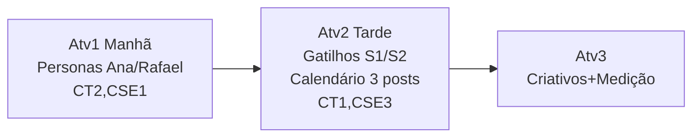

# 08 — Visão Geral da Atividade 2 (Neuromarketing e Calendário)

> [!QUOTE] Fonte literal — `Atividade_2_Aluno_Neuromarketing_e_Calendario_de_Conteudo.docx:1-14`
> - `SERVIÇO NACIONAL DE APRENDIZAGEM INDUSTRIAL – SENAI-SP`
> - `APERFEIÇOAMENTO PROFISSIONAL – MARKETING DIGITAL COM INTELIGÊNCIA ARTIFICIAL`
> - `ATIVIDADE 2 – NEUROMARKETING E CALENDÁRIO DE CONTEÚDO`
> - `Persona, neuromarketing e mensuração de resultados com apoio de Inteligência Artificial`

## 🪪 Identificação

| Campo | Valor literal |
|---|---|
| **Autor** | `Gabriel Guimarães Carneiro` |
| **Função** | `Instrutor – SENAI-SP` |
| **Local** | `Registro – SP` |
| **Ano** | `2026` |
| **Atividade** | `2 — Neuromarketing e Calendário de Conteúdo` |

> [!NOTE] Campos de capa
> `Aluno(a): _______________________________________________` — `Atividade_2_...docx:13`
> `Data: _____ / _____ / 2026` — `Atividade_2_...docx:14`

## 📝 Resumo Executivo

> [!QUOTE] `Atividade_2_...docx:11`
> `Este caderno apresenta a Atividade 2 (Tarde (bloco 1), duração de 2h) da sessão de encerramento do curso de Aperfeiçoamento Profissional Marketing Digital com Inteligência Artificial, do SENAI-SP. A atividade é individual, segue as estratégias de estudo de caso e situação-problema, e exige o uso de Inteligência Artificial generativa.`

> [!IMPORTANT] Características-chave Atv2
> - **Duração:** `2h` — `Tarde (bloco 1) 14h00-16h00` — `Atividade_2_...docx:26`
> - **Modalidade:** `Individual`
> - **Estratégias:** `estudo de caso` + `situação-problema`
> - **Requisito:** IA generativa + reaproveitar personas Atv1: `Reaproveite as personas e as peças produzidas nas atividades anteriores, pois o dia de hoje simula um único projeto de consultoria, do início ao fim.` — `Atividade_2_...docx:16`

## 🔑 Palavras-chave

> [!QUOTE] `Atividade_2_...docx:12`
> `Palavras-chave: Marketing Digital. Inteligência Artificial. Neuromarketing. Persona. Avaliação por capacidades.`

`#neuromarketing` — igual a Atv1, mas agora com foco Sistema 1/2 + gatilhos.

## 🎯 Objetivo Geral Atv2

> [!EXAMPLE] Missão da consultoria júnior — tarde
> Planejar o **calendário de conteúdo baseado em neuromarketing** para a **semana de lançamento da torra média premium** da `[[02-perfil-grao-vivo|Grão Vivo]]`, respondendo ao pedido do cliente:
> 1. Selecionar **≥3 gatilhos mentais distintos por persona** (de 7 opções) mapeados ao funil topo/meio/fundo
> 2. Criar **3 postagens** com canal + objetivo funil + gatilho
> 3. Usar IA para revisar lógica gatilho-canal-funil + justificar com Sistema 1/2

> [!WARNING] Situação-problema Atv2 — `Atividade_2_...docx:28`
> `Os primeiros anúncios de teste da nova linha de cafés da Grão Vivo usaram só argumentos racionais (ficha técnica da torra, comparação de preço) e converteram pouco no fundo de funil. Antes de produzir qualquer peça de comunicação, o cliente pede um planejamento: quais gatilhos mentais usar, para qual persona, em qual etapa do funil e em qual canal — ou seja, um calendário de conteúdo baseado em neuromarketing para a semana de lançamento.`

> [!TIP] Diferença Atv1 vs Atv2
> Atv1 = resolver **quem é** e **como personalizar** (personas/jornada/ML). Atv2 = **como comunicar** para converter — trocar racional puro por gatilhos S1/S2.

## 🧩 Onde esta atividade se encaixa

- **Sessão 8h:** `14h00-16h00 Atividade 2 CT1,CT4,CSE2,CSE3` — `Atividade_2_...docx:23` — ver [[03-cronograma#3.2 Quadro 3 — Transcrição Fiel (comum Atv1+Atv2)|Quadro 3]]
- **Ponte Atv1→Atv2:** `[[../entregaveis/personas/persona-01-indecisa-curadoria|Ana Clara 34]]` e `[[../entregaveis/personas/persona-02-comparador-valor|Rafael 38]]` já criadas em Atv1 são insumo obrigatório.

## 📚 Referências (cópia literal — `Atividade_2_...docx:46-48`)

> [!QUOTE]
> `CARNEIRO, Gabriel Guimarães. Comportamento do consumidor: gatilhos aplicados ao marketing. Registro: SENAI-SP, 2026. Material de apoio da unidade curricular.`
> `GABRIEL, Martha. Marketing na era digital. São Paulo: Atlas, 2020.`
> `SENAI. Departamento Regional de São Paulo. Plano de curso: Aperfeiçoamento Profissional – Marketing Digital com Inteligência Artificial. São Paulo: SENAI-SP, 2024.`
> `YANAZE, Mitsuru Higuchi. Marketing digital. São Paulo: Saraiva, 2022.`

---
> [!SUCCESS] Próximo passo
> [[09-tarefas-gatilhos-funil|09 — Gatilhos e Funil]] para dominar Sistema 1/2 + 7 gatilhos.

#visao-geral #atividade2
