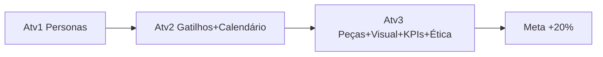

# 14 — Visão Geral da Atividade 3 (Criativos e Medição)

> [!QUOTE] Fonte literal — `Atividade_3_Aluno_Producao_dos_Criativos_e_Medicao_de_Resultados.docx:1-14`
> - `SERVIÇO NACIONAL DE APRENDIZAGEM INDUSTRIAL – SENAI-SP`
> - `APERFEIÇOAMENTO PROFISSIONAL – MARKETING DIGITAL COM INTELIGÊNCIA ARTIFICIAL`
> - `ATIVIDADE 3 – PRODUÇÃO DOS CRIATIVOS E MEDIÇÃO DE RESULTADOS`
> - `Persona, neuromarketing e mensuração de resultados com apoio de Inteligência Artificial`

## 🪪 Identificação

| Campo | Valor literal |
|---|---|
| **Autor** | `Gabriel Guimarães Carneiro` |
| **Função** | `Instrutor – SENAI-SP` |
| **Local** | `Registro – SP` |
| **Ano** | `2026` |
| **Atividade** | `3 — Produção dos Criativos e Medição de Resultados` |

## 📝 Resumo Executivo

> [!QUOTE] `Atividade_3_...docx:11`
> `Este caderno apresenta a Atividade 3 (Tarde (bloco 2), duração de 1h45) da sessão de encerramento do curso de Aperfeiçoamento Profissional Marketing Digital com Inteligência Artificial, do SENAI-SP. A atividade é individual, segue as estratégias de estudo de caso e situação-problema, e exige o uso de Inteligência Artificial generativa.`

> [!IMPORTANT] Características-chave Atv3
> - **Duração:** `1h45` — `Tarde (bloco 2) 16h15-18h00` — `Atividade_3_...docx:26`
> - **Modalidade:** `Individual`
> - **Estratégias:** `estudo de caso` + `situação-problema`
> - **Requisito:** IA generativa + reaproveitar tudo: `Reaproveite as personas e as peças produzidas nas atividades anteriores, pois o dia de hoje simula um único projeto de consultoria, do início ao fim.` — `Atividade_3_...docx:16`

## 🔑 Palavras-chave

> [!QUOTE] `Atividade_3_...docx:12`
> `Palavras-chave: Marketing Digital. Inteligência Artificial. Neuromarketing. Persona. Avaliação por capacidades.`

## 🎯 Objetivo Geral Atv3

> [!EXAMPLE] Missão consultoria júnior — fechar o projeto
> Com `[[../entregaveis/gatilhos/gatilhos-matriz-geral|gatilhos]]` + `[[../entregaveis/calendario/calendario-geral-3-posts|calendário 3 posts]]` da Atv2, produzir:
> 1. **3 peças de comunicação prontas** (texto/legenda) com gatilho + ≥1 com sensorial digital
> 2. **Conceito visual** de cada peça (composição, cores, elemento sensorial)
> 3. **Plano de KPIs** (≥4, com definição+mensuração+meta, via prompt IA)
> 4. **Nota ética IA** + **Reflexão final** ligando IA às etapas do curso

> [!WARNING] Situação-problema Atv3 — `Atividade_3_...docx:28`
> `Com o calendário de conteúdo e os gatilhos mentais definidos na Atividade 2, a Grão Vivo precisa que a consultoria produza as peças de comunicação prontas para publicação, além de um plano simples de indicadores para acompanhar se a campanha está funcionando.`

## 🧩 Onde se encaixa

- **Sessão 8h:** `16h15-18h00 Atividade 3 CT3,CT5,CT6,CSE1,CSE3` — `Atividade_3_...docx:23` — ver [[03-cronograma#3.2 Quadro 3 — Transcrição Fiel (comum Atv1+Atv2)|Quadro 3]]
- **Ponte Atv2→Atv3:** consome `[[../entregaveis/gatilhos/gatilhos-ana-clara|Ana]]`/`[[../entregaveis/gatilhos/gatilhos-rafael-moura|Rafael]]` + `[[../entregaveis/calendario/calendario-geral-3-posts|calendário 3 posts]]` → viram peças.

## 📚 Referências (cópia literal — `Atividade_3_...docx:48-51`)

> [!QUOTE]
> `CARNEIRO, Gabriel Guimarães. Comportamento do consumidor: gatilhos aplicados ao marketing. Registro: SENAI-SP, 2026.`
> `GABRIEL, Martha. Marketing na era digital. São Paulo: Atlas, 2020.`
> `SENAI. Plano de curso: Aperfeiçoamento Profissional – Marketing Digital com Inteligência Artificial. São Paulo: SENAI-SP, 2024.`
> `YANAZE, Mitsuru Higuchi. Marketing digital. São Paulo: Saraiva, 2022.`

---
> [!SUCCESS] Próximo passo
> [[15-tarefas-criativos|15 — Tarefas Criativos]] para as 3 peças + sensorial + revisão.

#visao-geral #atividade3
