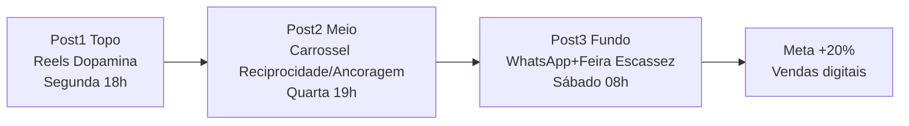

# Calendário Geral — 3 Postagens — Semana Lançamento Torra Média Premium

> [!QUOTE] Fonte — `Atividade_2_...docx:32,40`
> `c) elaborar um calendário de conteúdo com 3 postagens para a semana de lançamento da nova linha de cafés, indicando, para cada postagem, o canal, o objetivo no funil e o gatilho mental de referência;` — `Atividade_2_...docx:32`
> `b) calendário de 3 postagens, com canal, objetivo de funil e gatilho mental de referência para cada uma;` — `Atividade_2_...docx:40`

> [!INFO] Entregável b — use esta tabela na entrega Word/PDF
> Gatilhos vêm de `[[../gatilhos/gatilhos-matriz-geral|matriz geral]]` — `[[../gatilhos/gatilhos-ana-clara|Ana]]` + `[[../gatilhos/gatilhos-rafael-moura|Rafael]]`.

## Tabela Entrega b) — 3 Postagens

| # | Data / Dia | Horário | Canal | Objetivo Funil | Gatilho referência (S1/S2) | Persona alvo | Copy / Formato | Métrica |
|---|---|---|---|---|---|---|---|
| **1** | `Seg 01/09` | `18h` | `Instagram Reels` 15s | **Topo** — atenção, descoberta | **Dopamina S1** (Ana) + **Prova social S1** (Rafael) — `[[../gatilhos/gatilhos-ana-clara\|Ana]]` + `[[../gatilhos/gatilhos-rafael-moura\|Rafael]]` | `Ana + Rafael` — 60% frio | Reels 15s: `“Qual Grão Vivo é você? Quiz 30s — descubra seu café em 3 perguntas!”` + CTA quiz + selo `4.8⭐ 127 vizinhos` | `Views Reels, CTR quiz >12%, alcance` |
| **2** | `Qua 03/09` | `19h` | `Instagram Carrossel (4 cards) + WhatsApp Status` | **Meio** — consideração, prova valor | **Reciprocidade S1** (Ana) + **Ancoragem S2→S1** (Rafael) | `Ana (reciprocidade kit) + Rafael (ancoragem preço)` | Carrossel 1: `“De R$55 por R$45”` (ancora), 2: comparativo `Grão Vivo fresco vs mercado R$38`, 3: `Kit 3×50g frete grátis 1ª`, 4: CTA WhatsApp `“Tira dúvida <2min”` | `Cliques carrossel, tempo página, cliques WhatsApp` |
| **3** | `Sáb 06/09` | `08h` | `WhatsApp Business + Feira física aos sábados` | **Fundo** — conversão | **Escassez S1 + Urgência S1 + Identidade S1** — ambas | `Ana + Rafael` — conversão final | WhatsApp broadcast + banner feira: `“Lote torra média premium 40 unidades — até domingo 12h ou acaba. Retira feira sábado. Café da nossa região — Vale do Ribeira.”` + botão checkout | `Taxa conversão fundo, nº retiradas feira, vendas +20%` |

> [!WARNING] Coerência gatilho-canal-funil (CC-c)
> - Topo S1 Dopamina → Reels rápido visual (S1 atenção) ✓
> - Meio S1+S2→S1 Reciprocidade/Ancoragem → Carrossel comparativo (raciocínio + emoção) ✓
> - Fundo S1 Escassez/Urgência/Identidade → WhatsApp 1:1 + feira (prova local, urgência) ✓

### Fluxo Funil

## Checklist CC-c + Desejável c

- [x] 3 postagens com canal + funil + gatilho coerentes #criterio/critico
- [x] Canais são `Quadro 2`: IG 8.200, WhatsApp, feira sábado #validacao
- [x] Gatilhos vêm de `[[../gatilhos/gatilhos-matriz-geral|matriz]]` #reaproveitamento
- [x] Métrica por postagem (desejável c) #desejavel

### Detalhe por Post

- `[[calendario-post-01-topo-dopamina|Post 01 Topo]]` — detalhe + copy + criativo
- `[[calendario-post-02-meio-reciprocidade-ancoragem|Post 02 Meio]]` — detalhe
- `[[calendario-post-03-fundo-escassez|Post 03 Fundo]]` — detalhe

---
> [!SUCCESS] Entregável b) pronto
> Copie esta tabela para Word/PDF + anexe 3 posts detalhados.

#calendario #entregavel-b
