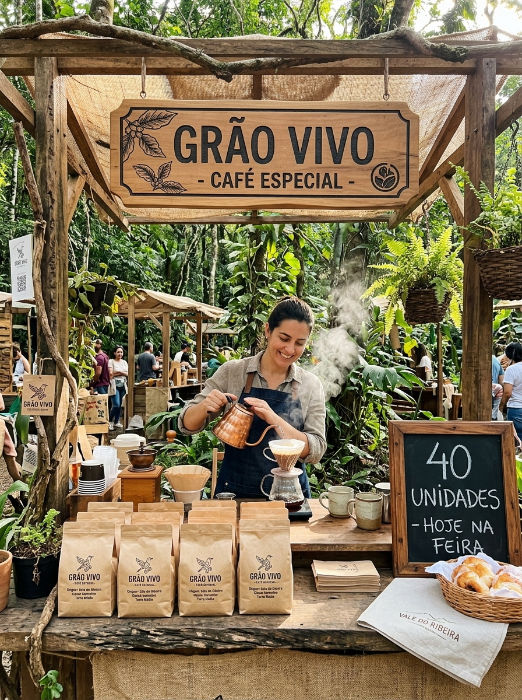

# Conceito Visual 03 — Fundo — WhatsApp + Feira Escassez

> [!QUOTE] Fonte — `Atividade_3_...docx:32`
> `c) descrever, com apoio de IA, o conceito visual de cada postagem (composição, cores, elemento sensorial);` — ver `[[peca-03-fundo-escassez|Peça 03]]`

## Composição

| Elemento | Descrição |
|---|---|
| **WhatsApp broadcast** | Foto feira Registro lotada (fundo) + card café torrado 40un central + badge amarelo `“40 UNIDADES”` canto superior + QR code canto inferior |
| **Banner feira 60×90cm** | Amarelo Vale + preto Espresso — `“40 UNIDADES — HOJE ATÉ 12H”` + QR grande + selo `“Torra da semana”` Gold |
| **Pós-compra** | Card `“Avalie e ganhe 10%”` com estrelas 4.8⭐ |

## Cores

- **Vale #2E4A3A** — banner feira (identidade local)
- **Gold #C9A86A** — badge 40un (urgência)
- **Espresso #1A120B** — texto `“HOJE ATÉ 12H”`
- **Creme #F5EFE6** — fundo WhatsApp card

## Elemento Sensorial

> [!SUCCESS] Sensorial olfativo sugerido
> **Foto feira com vapor café torrado** + legenda `“Sente o cheiro da torra fresca?”` — adapta marketing sensorial olfativo para digital via imagem vapor + cor quente. Feira física completa com cheiro real no sábado.

## Imagem Gerada por IA

## Fonte Pexels + Prompt

- **Pexels:** `https://www.pexels.com/photo/320607/` (feira) + `6802983` (café)
- **Prompt:** `[[prompt-imagem-03-fundo|prompt-imagem-03-fundo.md]]`

#visual-03 #fundo
