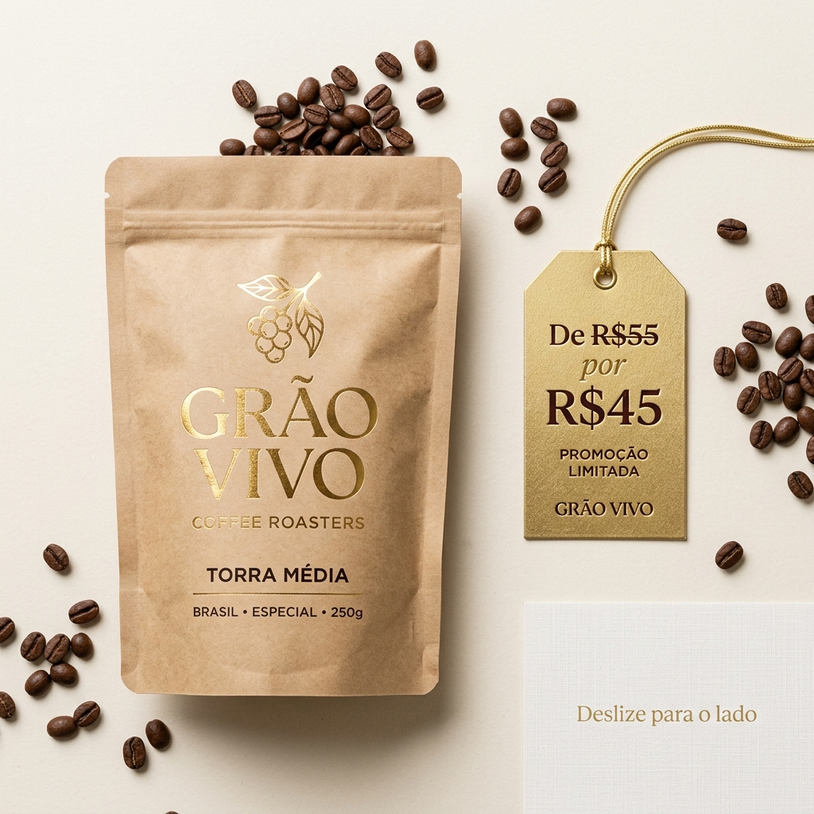
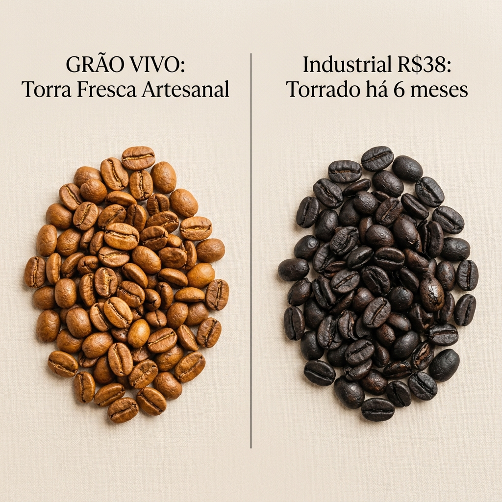
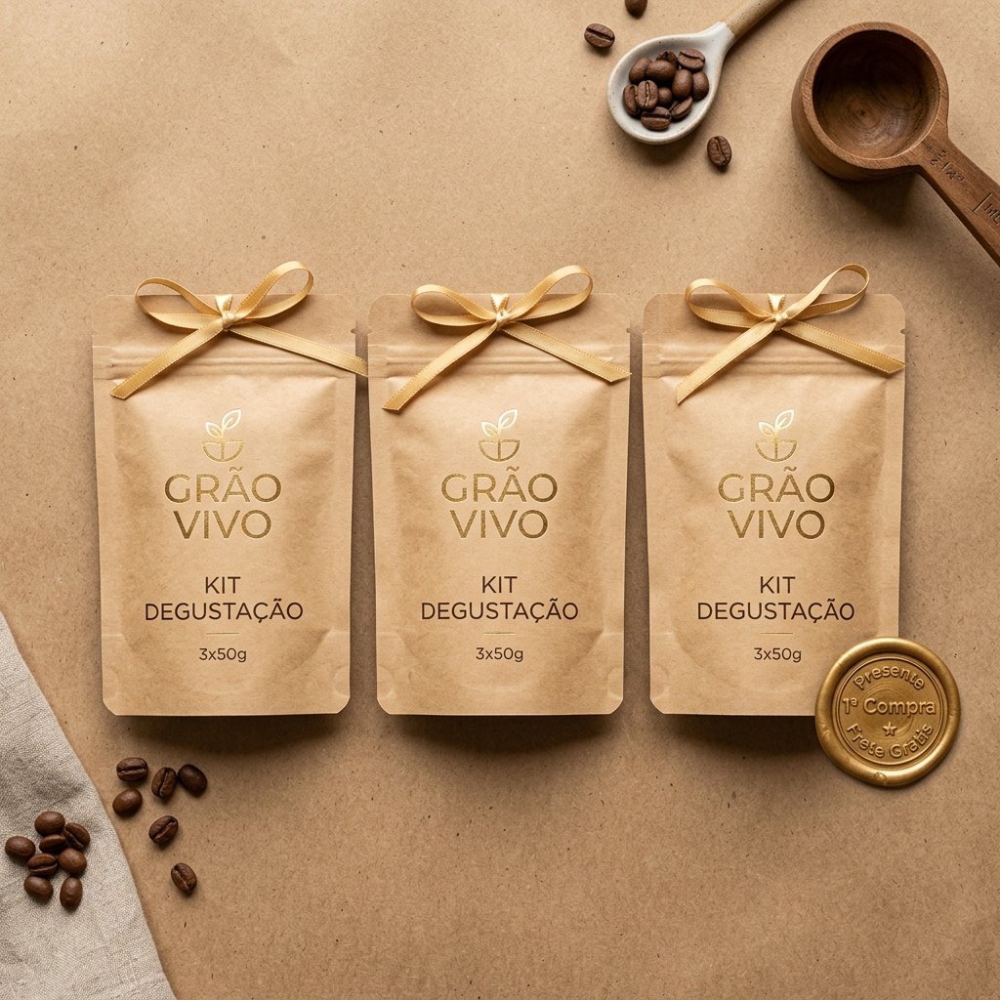
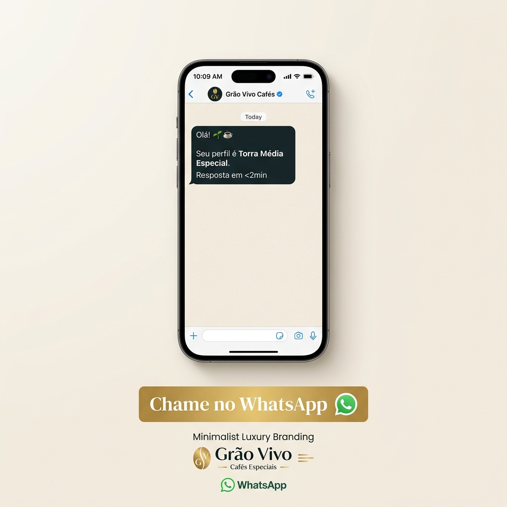

# Peça 02 — Meio — Carrossel 4 Cards + WhatsApp — Reciprocidade S1 + Ancoragem S2→S1

> [!QUOTE] Fonte — `Atividade_3_...docx:30` + `calendario-post-02-meio-reciprocidade-ancoragem.md:12`
> Canal: `IG Carrossel 4 cards + WhatsApp Status` — Meio — **Reciprocidade S1** (Ana) + **Ancoragem S2→S1** (Rafael) — `Qua 03/09 19h` — ver `[[../calendario/calendario-post-02-meio-reciprocidade-ancoragem|Post 02]]`

## Texto IA (original)

> [!QUOTE] ChatGPT gerou
> `“R$45 barato! Kit legal da Grão Vivo. Aproveite!”`

> [!WARNING] Problemas
> - Sem ancoragem S2→S1 (`R$55→R$45`)
> - Sem contraste `vs R$38 industrial`
> - Sem reciprocidade explícita (kit presente)

## Texto Definitivo (após revisão)

> [!SUCCESS] Legenda + Carrossel 4 Cards — **texto definitivo**
> **CARD 1 (Ancoragem S2→S1):** `De R$55 por R$45 — torra média premium`
> `Riscado R$55 (âncora) → R$45 em Gold — “por que vale? → arrasta”`
>
> **CARD 2 (Ancoragem comparativa):** `Grão Vivo fresco (torra semanal no Vale) vs mercado R$38 industrial (torra há 6 meses, sabor queimado)`
> `Foto macro grãos Vale vs pacote mercado desfocado`
>
> **CARD 3 (Reciprocidade S1):** `Kit 3×50g frete grátis 1ª compra — presente da nossa torra para sua casa`
> `“A gente te presenteia, você decide seu favorito sem risco”`
>
> **CARD 4 (CTA):** `Tira dúvida no WhatsApp <2min — “Ana, seu café é o Médio”`
> `Selo “Vale do Ribeira — da nossa terra” [Identidade S1 bônus]`
>
> **LEGENDA:**
> `Ainda comparando R$45 com R$38 do mercado? [Ancoragem S2→S1 para Rafael]`
> `Ancoramos em R$55 (premium SP) → R$45 Grão Vivo fresco da semana vale cada centavo. [S2 racionaliza, S1 alivia]`
> `E para Ana: Kit 3×50g frete grátis — presente para provar sem desperdiçar 250g. [Reciprocidade S1]`
> `Qual combinação é sua? Chama no WhatsApp — resposta <2min.`
>
> **WHATSAPP Status:** mesmos 4 cards + link site comparativo

## Revisão Crítica (b)

| Alteração | Justificativa |
|---|---|
| `“R$45 barato” → “De R$55 por R$45 vs R$38 industrial (6 meses)”` | `R$45 barato` é vago e S2 fraco. Ancoragem com `R$55 riscado + contraste R$38 industrial` ativa S2→S1 — Rafael compara e sente alívio. |
| `Adicionado “Kit 3×50g frete grátis — presente”` | Faltava Reciprocidade S1 para Ana — kit presente cria obrigação emocional de retribuir (comprar). |
| `Adicionado CTA específico “WhatsApp <2min — Ana, seu café é o Médio”` | Meio precisa ponte para fundo — conecta ao chatbot Atv1 (<2min) e personalização. |

## Imagens do Carrossel Geradas por IA (4 Cards)

### Card 1 — Ancoragem (De R$55 por R$45)

### Card 2 — Comparativo (Grão Vivo Fresco vs Industrial R$38)

### Card 3 — Reciprocidade (Kit Degustação 3x50g Presente)

### Card 4 — CTA WhatsApp (<2min)

> [!INFO] Conceito visual detalhado
> Ver `[[conceito-visual-02-meio|conceito-visual-02-meio.md]]` + `[[prompt-imagem-02-meio|prompt-imagem-02-meio.md]]` (prompt imagem registrado com negative/seed/licença).

- [x] Gatilho Reciprocidade+Ancoragem + canal IG Carrossel Meio #criterio/critico
- [x] ≥1 alteração + justificativa #tarefa/b-atv3

#peca-02 #meio
