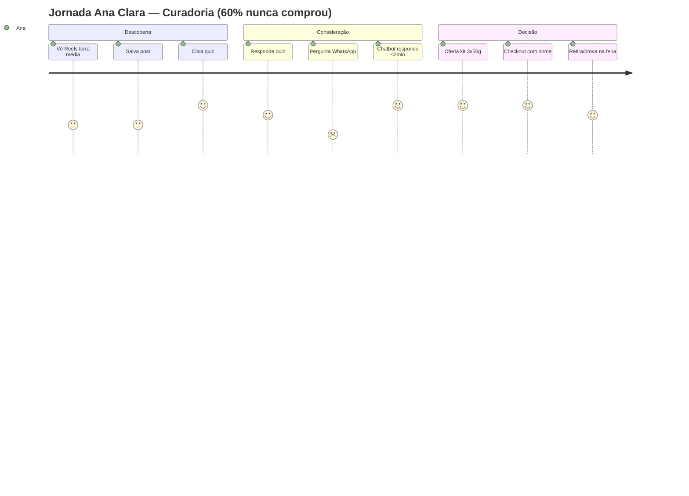

# Jornada do Cliente — Persona 01: Ana Clara, 34 anos

> [!QUOTE] Fonte — `Atividade_1_Aluno_Persona_e_Experiencia_do_Cliente.docx:33` + `Quadro 2`
> `d) mapear, para cada persona, a jornada do cliente nas etapas de descoberta, consideração e decisão;`
> Dificuldade: `dificuldade dos clientes em escolher entre os tipos de café oferecidos.` → `“Sigo a página faz tempo, mas nunca sei qual café combina comigo.”`
> Meta: `aumentar em 20% as vendas digitais no primeiro mês.` — nova linha `cafés especiais de torra média, posicionados como produto premium.`

> [!INFO] Persona âncora
> Ver `[[../personas/persona-01-indecisa-curadoria|Persona 01 — Ana Clara]]` — professora, Registro/SP, segue IG há 9 meses, 60% nunca comprou, precisa de curadoria <2min.

## Mapa — 3 Etapas

| Etapa | Ação da persona | Pensamento / Sentimento | Touchpoint | Oportunidade de personalização | Conteúdo / Ferramenta | Métrica |
|---|---|---|---|---|---|---|
| **1. Descoberta** | Vê Reels `“Torra média Grão Vivo: para quem toma com leite e sem amargor”` no IG, salva o post | `Curiosidade + identificação: “Esse parece ser o meu! Mas será?”` — baixa confiança | `Instagram Reels / Feed` | Quiz `“Qual Grão Vivo combina com você? 3 perguntas, 30s”` com resultado único + prova social local | Quiz interativo no IG Stories/Carrossel linkado ao WhatsApp | `CTR Reels >8%` · `Taxa início quiz >15%` |
| **2. Consideração** | Clica no quiz, responde sobre paladar suave/com leite; manda DM `“Qual diferença do médio para o claro?”` | `Dúvida ativa: “Não quero errar e desperdiçar R$45”` — busca validação imediata | `WhatsApp Business` | **Chatbot NLP + motor recomendação**: resposta em <2min `“Para seu paladar suave com leite: Grão Vivo Médio — equilíbrio, notas achocolatadas. Kit 3x50g para provar sem risco”` | Chatbot treinado nos 4 comentários + FAQ torra média | `Tempo resposta <2min` · `Taxa conclusão quiz` |
| **3. Decisão** | Recebe recomendação + oferta `kit degustação 3x50g + frete grátis 1ª compra` + link checkout; retira dúvida na feira sábado | `Segurança + pertencimento: “Vou provar pouco, se gostar compro maior. É daqui da região.”` | `Loja virtual (checkout) + Feira física sábado` | Checkout personalizado `“Ana, seu café é o Médio”` + opção `retirar na feira` + follow-up `“Como foi seu primeiro Médio?”` | Motor recomendação content-based + e-mail/WhatsApp pós-compra | `Taxa conversão >4%` · `Ticket R$45` · `NPS` para meta +20% |

### Fricções e antídotos

> [!WARNING] Fricções mapeadas
> - **Descoberta → Consideração:** paralisia por excesso de opções → antídoto quiz com 1 recomendação clara
> - **Consideração → Decisão:** demora no WhatsApp (6h histórico Ana) → antídoto chatbot NLP 24/7
> - **Decisão:** medo de desperdício 250g → antídoto kit pequeno + frete grátis

### Visual — Mermaid Journey

## Checklist (CC-b)

- [x] 3 etapas preenchidas com ação + pensamento + touchpoint + oportunidade #jornada
- [x] Touchpoints IG + WhatsApp + feira presentes #validacao
- [x] Oportunidade ligada a personalização com dados/ML (quiz + chatbot) #CT2
- [x] Métrica por etapa para validar personas (CD-a) #CD-a

---

> [!SUCCESS] Próxima
> [[jornada-persona-02-rafael-moura|Jornada Persona 02 — Rafael]] + `[[../../templates/proposta-personalizacao|proposta]]` para justificar ferramenta.

#jornada #ana-clara
