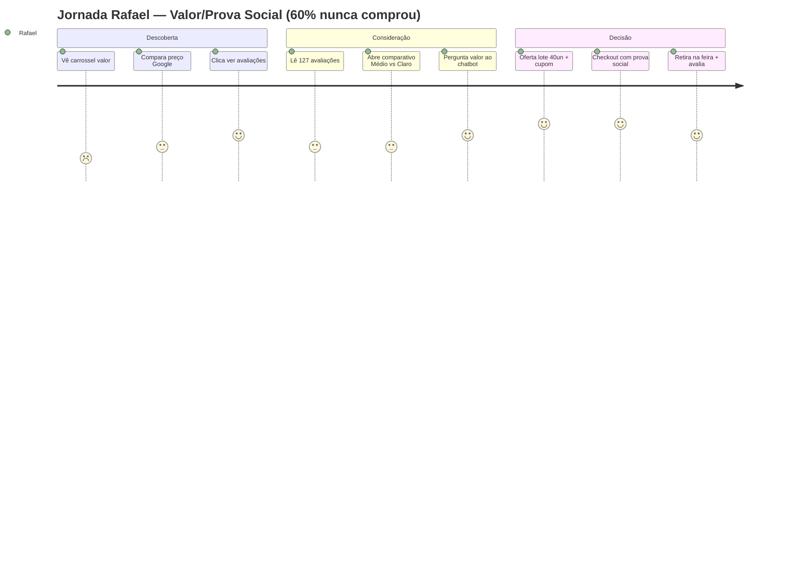

# Jornada do Cliente — Persona 02: Rafael Moura, 38 anos

> [!QUOTE] Fonte — `Atividade_1_Aluno_Persona_e_Experiencia_do_Cliente.docx:33` + `Quadro 2`
> `d) mapear, para cada persona, a jornada do cliente nas etapas de descoberta, consideração e decisão;`
> Dificuldade: `dificuldade dos clientes em escolher entre os tipos de café oferecidos.` → `“Vi um preço parecido em outro lugar e fiquei em dúvida se vale a pena aqui.”` + `“Queria comprar, mas não vi ninguém comentando se é bom.”`
> Nova linha: `cafés especiais de torra média, posicionados como produto premium.` — Meta `+20% vendas digitais`

> [!INFO] Persona âncora
> Ver `[[../personas/persona-02-comparador-valor|Persona 02 — Rafael]]` — comerciante, Pariquera-Açu/SP, compara preço no Google Shopping, lê avaliações, nunca comprou (60%).

## Mapa — 3 Etapas

| Etapa | Ação da persona | Pensamento / Sentimento | Touchpoint | Oportunidade de personalização | Conteúdo / Ferramenta | Métrica |
|---|---|---|---|---|---|---|
| **1. Descoberta** | Vê carrossel IG `“Por que Grão Vivo torra média vale R$45: origem Vale do Ribeira + torra fresca + 4.8⭐ 127 avaliações”` enquanto compara preço | `Ceticismo racional: “Tá igual no mercado, por que pagar aqui?”` — baixa percepção de valor | `Instagram Carrossel / Reels` | Conteúdo comparativo de valor + prova social UGC (vídeo cliente da região) | Motor recomendação com ranking `“Mais bem avaliados”` + selo origem | `Engajamento carrossel` · `CTR “ver avaliações”` |
| **2. Consideração** | Clica em `“Ver avaliações”`, lê 10 comentários, abre tabela `“Médio vs Claro vs Escuro: qual vale mais para você?”`; hesita no preço | `Busca validação: “Se ninguém fala que é bom, não arrisco. Se todo mundo fala, pago.”` — precisa prova + comparativo | `Site / Link bio IG` | **Motor recomendação + assistente virtual**: comparativo dinâmico `“Para custo/benefício + paladar intenso, Grão Vivo Médio é o mais pedido em Registro”` + chatbot responde valor em <2min | Assistente com filtragem content-based + NLP para dúvida preço | `Tempo na página` · `Taxa clique comparativo` |
| **3. Decisão** | Recebe oferta personalizada `“Rafael, lote torra média premium — 40 unidades, retira na feira sábado ou entrega hoje”` + cupom `“1ª compra frete grátis”` + garantia `“Não gostou? Troca na feira”` | `Confiança + urgência local: “Agora entendi o valor e vi gente daqui comprando. Vou testar.”` | `WhatsApp Business + Loja virtual + Feira sábado` | Checkout com prova social dinâmica `“127 clientes da região compraram este mês”` + follow-up `“Avalie e ganhe 10%”` para gerar UGC | Chatbot + e-mail pós-compra para loop de prova social | `Taxa conversão >4%` · `Ticket R$45` · `Nº avaliações geradas` para meta +20% |

### Fricções e antídotos

> [!WARNING] Fricções mapeadas
> - **Descoberta:** preço igual ao mercado sem diferencial → antídoto conteúdo valor (origem + frescor + nota)
> - **Consideração:** falta de prova social → antídoto ranking + vídeos UGC + comparativo guiado
> - **Decisão:** dúvida residual → antídoto urgência lote + garantia troca na feira + resposta instantânea

### Visual — Mermaid Journey

## Diferença para Persona 01

> [!EXAMPLE] Complementaridade
> - **Ana** trava por **curadoria pessoal** → jornada foca em quiz + recomendação única
> - **Rafael** trava por **valor + prova** → jornada foca em comparativo + ranking + UGC
> Juntas cobrem as 2 faces da `dificuldade em escolher` e permitem **personalização por cluster** (CT2/CT4) para atingir `+20%`.

## Checklist (CC-b)

- [x] 3 etapas preenchidas com ação + pensamento + touchpoint + oportunidade #jornada
- [x] IG + WhatsApp + feira presentes #validacao
- [x] Oportunidade com dados/ML (ranking + chatbot) #CT2
- [x] Métrica por etapa + UGC para CD-a #CD-a

---

> [!SUCCESS] Próxima
> `[[../../templates/proposta-personalizacao|Proposta de personalização]]` para justificar ferramenta com dados/ML (CC-d) e `[[../personas/README|Personas]]` para visão completa.

#jornada #rafael-moura
