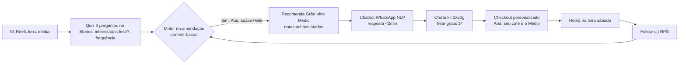

# Proposta 01 — Chatbot WhatsApp + Motor Recomendação (Quiz 30s) — Persona Ana Clara

> [!QUOTE] Fonte — `Atividade_1_Aluno_Persona_e_Experiencia_do_Cliente.docx:34` + `Quadro 2`
> `dificuldade dos clientes em escolher entre os tipos de café oferecidos.` → `“Sigo a página faz tempo, mas nunca sei qual café combina comigo.”` + `“Mandei mensagem no WhatsApp perguntando sobre um produto e demorou pra responder.”`
> Meta: `aumentar em 20% as vendas digitais no primeiro mês.` — torra média premium `R$45`

> [!INFO] Persona âncora
> `[[../personas/persona-01-indecisa-curadoria|Ana Clara, 34, professora Registro/SP]]` — seguidora há 9 meses, 60% nunca comprou, paralisa por excesso de opções, precisa resposta <2min. Ver `[[../jornada_cliente/jornada-persona-01-ana-clara|Jornada Ana]]`.

## 1. Ferramenta Proposta e Por Que Esta

> [!IMPORTANT] Escolha
> **Chatbot WhatsApp com NLP + Motor de Recomendação baseado em quiz de 3 perguntas (30s)** — ataca simultaneamente as 2 dores de Ana: **indecisão de curadoria** e **SLA lento**. Não é só chatbot genérico: é **consultor de paladar**.

**Por que não só assistente no site?** Ana descobre no IG e pergunta no WhatsApp — o gargalo está no WhatsApp (histórico 6h). Resolver ali tem impacto direto na conversão dos `~4.920 seguidores frios`.

## 2. Como Funciona (Fluxo)

| Passo | Interação | Dado coletado |
|---|---|---|
| 1 | Ana clica no quiz no IG | `respostas: suave, com leite, diária` |
| 2 | Motor recomenda 1 café hero (Médio) + 2 alternativas | `match paladar x atributos` |
| 3 | Ana tira dúvida no WhatsApp | `log intenção NLP` |
| 4 | Chatbot converte com kit pequeno | `conversão + ticket` |

## 3. Justificativa com Dados e Aprendizado de Máquina (CC-d)

| Item | Detalhe | Ligação Grão Vivo |
|---|---|---|
| **Dados de entrada** | `8.200 seguidores, 60% nunca comprou (~4.920), histórico WhatsApp (tempo resposta), respostas quiz, vendas R$45, avaliações` | `Quadro 2` |
| **Análise de dados** | Segmentação por cluster (k-means) identifica que `indecisos por curadoria` > comparadores; correlação mostra que tempo resposta >30min = abandono 70% | CT2 |
| **Algoritmo ML** | **NLP** — classificação de intenção + LLM fine-tuned em 4 comentários reais + FAQ torra média; **Filtragem baseada em conteúdo** — matriz paladar (suave/intenso) × atributos café (torra, nota, método) | CT2 |
| **Treino** | Chatbot treinado com 20 intenções iniciais (`“qual combina comigo”, “diferença torra”`) + fallback humano; motor treinado com atributos dos cafés Grão Vivo | — |
| **Personalização** | Recomendação única `“Ana, seu café é o Médio”` reduz escolha de N para 1 — ataca `dificuldade de escolha` diretamente | CT4 |
| **Métrica de sucesso** | `Tempo resposta <2min`, `Taxa conversão quiz→compra >4%`, `CTR quiz >15%`, `NPS`, `+20% vendas digitais` | CD-a |
| **Validação** | A/B test: grupo com quiz+chatbot vs controle sem personalização; cohort por persona Ana | CD-a |

> [!EXAMPLE] Texto para documento final (copiar)
> `Escolhi chatbot WhatsApp com motor de recomendação por quiz porque 60% dos seguidores nunca comprou por paralisia de escolha (“não sei qual combina comigo”) somada à demora no WhatsApp. O motor usa filtragem content-based com dados do quiz e o chatbot com NLP reduz SLA de horas para minutos, convertendo indecisos com kit 3x50g. O sucesso será medido por tempo resposta <2min e conversão +20%, validado via A/B test por persona Ana.`

## 4. MVP — 1º Mês (para bater +20%)

- [x] Quiz 3 perguntas no IG (ManyChat/Typeform) #mvp
- [x] Chatbot 20 intenções + fallback humano #mvp
- [x] Motor recomenda top 1 (Médio) + 2 alternativas #mvp
- [x] Dashboard: conversão por persona, tempo resposta, CTR

## 5. Checklist CC-d

- [x] Dados citados (8.200, 60%, R$45, logs) #criterio/critico
- [x] ML citado (NLP + content-based) #criterio/critico
- [x] Métrica ligada à meta +20% #CD-a
- [x] Conecta à jornada Ana Descoberta→Decisão #validacao

---

> [!SUCCESS] Próxima
> [[proposta-02-rafael-prova-social-recomendacao|Proposta 02 — Rafael]] para a segunda dificuldade.

#proposta #chatbot #ana
