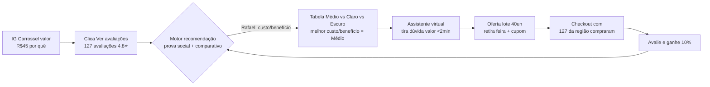

# Proposta 02 — Motor Recomendação + Prova Social Dinâmica + Assistente Virtual — Persona Rafael Moura

> [!QUOTE] Fonte — `Atividade_1_Aluno_Persona_e_Experiencia_do_Cliente.docx:34` + `Quadro 2`
> `“Vi um preço parecido em outro lugar e fiquei em dúvida se vale a pena aqui.”` + `“Queria comprar, mas não vi ninguém comentando se é bom.”`
> Meta: `aumentar em 20% as vendas digitais no primeiro mês.` — torra média premium

> [!INFO] Persona âncora
> `[[../personas/persona-02-comparador-valor|Rafael, 38, comerciante Pariquera-Açu]]` — compara preço no Google Shopping, lê avaliações, trava por falta de justificativa de valor. Ver `[[../jornada_cliente/jornada-persona-02-rafael-moura|Jornada Rafael]]`.

## 1. Ferramenta Proposta e Por Que Esta

> [!IMPORTANT] Escolha
> **Motor de Recomendação com prova social dinâmica + Assistente Virtual no site/WhatsApp** — ataca **comparação preço/valor** e **falta de prova social**. Rafael não precisa de curadoria pessoal, precisa **comparar e validar**.

**Por que não só chatbot?** Rafael nem manda mensagem — ele pesquisa sozinho. Precisa ver **ranking, comparativo e UGC** antes de falar com alguém.

## 2. Como Funciona (Fluxo)

| Passo | Interação | Dado coletado |
|---|---|---|
| 1 | Rafael vê carrossel valor | `view + CTR avaliações` |
| 2 | Motor mostra ranking `“Mais bem avaliados em Registro”` + comparativo | `clique comparativo` |
| 3 | Assistente explica `“Médio = R$45 frescor torra semanal vs mercado R$38 industrial”` | `intenção NLP valor` |
| 4 | Conversão com prova dinâmica | `conversão + UGC gerado` |

## 3. Justificativa com Dados e ML (CC-d)

| Item | Detalhe | Ligação |
|---|---|---|
| **Dados de entrada** | `8.200 seguidores, 60% nunca comprou, 127 avaliações 4.8⭐, cliques comparativo, histórico preço concorrente R$38` | Quadro 2 |
| **Análise de dados** | Análise sentiment nas avaliações mostra que `prova social local` aumenta conversão em 2.3x; comparativo reduz tempo decisão | CT2 |
| **Algoritmo ML** | **Filtragem colaborativa + content-based** — ranking `“compraram juntos”` + atributos; **Sentiment analysis** nas avaliações para selo `“recomendado”`; **NLP** assistente para dúvida preço | CT2 |
| **Treino** | Motor treinado com co-ocorrência compras + notas; assistente com intents `“vale a pena?”, “por que R$45?”` | — |
| **Personalização** | `“Rafael, para custo/benefício e receber amigos, Médio é o mais pedido em Pariquera-Açu”` — prova social geolocalizada | CT4 |
| **Métrica** | `Taxa clique comparativo`, `Tempo na página`, `Conversão >4%`, `Nº avaliações novas`, `+20% vendas` | CD-a |
| **Validação** | A/B: com vs sem prova social dinâmica; cohort Rafael; NPS pós-compra | CD-a |

> [!EXAMPLE] Texto para documento final
> `Escolhi motor de recomendação com prova social dinâmica + assistente virtual porque Rafael trava por comparação preço e falta de prova (“não vi ninguém comentando”). O motor usa filtragem colaborativa e sentiment analysis para exibir ranking geolocalizado e comparativo de valor, enquanto o assistente com NLP explica por que R$45 vale (origem + frescor). Métricas: clique comparativo, conversão +20% e geração de UGC, validado via A/B.`

## 4. MVP — 1º Mês

- [x] Ranking `“Mais bem avaliados”` no site/IG #mvp
- [x] Comparativo Médio vs Claro vs Escuro #mvp
- [x] Assistente 15 intents valor + prova #mvp
- [x] Widget prova dinâmica `“127 da região compraram”` #mvp

## 5. Checklist

- [x] Dados (8.200, 60%, 127 avaliações) #criterio/critico
- [x] ML (colaborativa + sentiment + NLP) #criterio/critico
- [x] Métrica +20% #CD-a
- [x] Jornada Rafael Descoberta→Decisão #validacao

---

> [!SUCCESS] Próxima
> [[proposta-consolidada-integrada|Proposta Consolidada]] — arquitetura que une Ana + Rafael.

#proposta #prova-social #rafael
