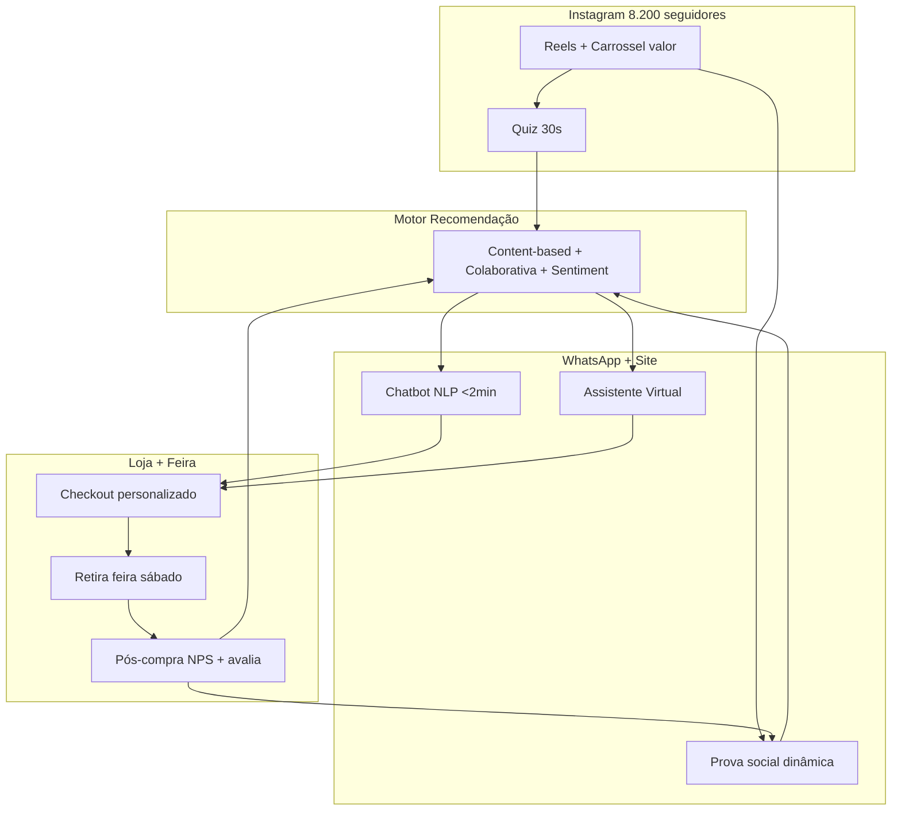

# Proposta Consolidada — Arquitetura Integrada (CD-c: Além do Mínimo)

> [!QUOTE] Fonte — `Atividade_1_Aluno_Persona_e_Experiencia_do_Cliente.docx:34` + `TABLE 3 CD-c`
> `apresenta proposta de personalização que vai além do mínimo solicitado.` — critério desejável **CD-c**

> [!INFO] Unifica
> `[[proposta-01-ana-chatbot-recomendacao|Proposta 01 — Ana (chatbot+quiz)]]` + `[[proposta-02-rafael-prova-social-recomendacao|Proposta 02 — Rafael (ranking+assistente)]]` → cobre **100% das dificuldades de escolha** e `60% nunca comprou` para bater `+20%`.

## Arquitetura Integrada

| Camada | Ferramenta | Dados/ML | Persona atendida |
|---|---|---|---|
| **Captação** | Quiz 30s no IG | Clustering k-means segmenta Ana vs Rafael | Ambas |
| **Recomendação** | Motor híbrido (content + colaborativa) | Matriz paladar × atributos + co-ocorrência | Ana (curadoria) + Rafael (valor) |
| **Conversação** | Chatbot NLP + Assistente | Classificação intenção + LLM, 35 intents | Ana (SLA) + Rafael (dúvida preço) |
| **Prova** | Widget dinâmico `“127 da região”` + UGC | Sentiment analysis + geolocalização | Rafael |
| **Conversão** | Checkout nomeado + kit 3x50g | Regra `“se Ana → kit; se Rafael → lote 40un”` | Ambas |
| **Loop** | NPS + `“avalie e ganhe 10%”` | Feedback retreina motor | Ambas |

## Justificativa Consolidada (CT2/CT4 + CD-a)

| Dados | ML | Métrica +20% |
|---|---|---|
| `8.200, 60% frio, R$45, 127 avaliações, logs WhatsApp, respostas quiz` | `NLP + content-based + colaborativa + sentiment + clustering` | `Conversão >4%, CTR quiz >15%, tempo <2min, UGC +30%, NPS` |
| A/B test integrado: fluxo completo vs fluxo sem personalização | Dashboard cohort por persona | Validação CD-a: indicadores por persona |

> [!TIP] Diferencial CD-c
> Além de chatbot **ou** recomendação isolados, entrega **ecossistema**: IG → quiz → motor → chatbot/assistente → prova dinâmica → checkout → feira → loop. Cada touchpoint gera dado que retreina o próximo.

## Roadmap 30-60-90 dias

| Dia | Entrega |
|---|---|
| **D0-30** | MVP 01+02 (quiz, chatbot 20 intents, ranking, kit) — meta +20% |
| **D31-60** | Geolocalização prova social + e-mail segmentado por cluster |
| **D61-90** | Recomendação preditiva `“próxima compra”` + assinatura |

## Checklist

- [x] Vai além do mínimo (CD-c) #desejavel
- [x] Justifica com dados + ML (CC-d) #criterio/critico
- [x] Cobre Ana + Rafael (CC-a/b) #validacao
- [x] Métrica +20% #CD-a

---

> [!SUCCESS] Entrega completa
> Esta proposta consolidada fecha a tarefa (e). Inclua no documento final `entregaveis/` com `[[../personas/README|personas]]` + `[[../jornada_cliente/README|jornadas]]`.

#consolidada #integrada
