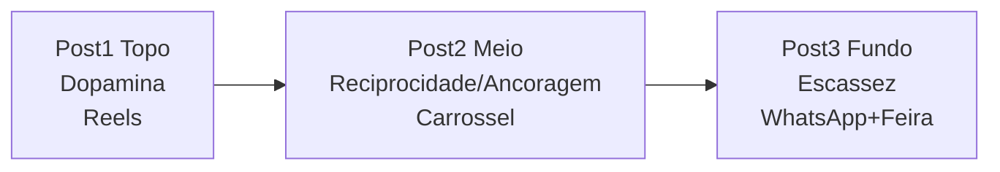

# Template — Calendário 3 Postagens — Semana Lançamento

> [!INFO] Como usar
> Copie para `entregaveis/calendario/` e preencha. Cada linha precisa: canal + funil + gatilho (de `[[gatilhos-por-persona|gatilhos]]`) — `[[10-calendario-conteudo]]`.

> [!QUOTE] Fonte — `Atividade_2_...docx:32`
> `elaborar um calendário de conteúdo com 3 postagens para a semana de lançamento, indicando, para cada postagem, o canal, o objetivo no funil e o gatilho mental de referência;`

| # | Data / Dia | Canal | Funil | Gatilho referência | Persona alvo | Copy / Formato | Métrica |
|---|---|---|---|---|---|---|---|
| 1 | `Seg 01/09` | `Instagram Reels` | `Topo` | `Dopamina (S1) — Ana` | `Ana + Rafael` | `Reels 15s quiz 30s + CTA “Descubra seu Grão Vivo”` | `Views, CTR quiz` |
| 2 | `Qua 03/09` | `Instagram Carrossel + WhatsApp` | `Meio` | `Reciprocidade (Ana) + Ancoragem (Rafael)` | `Ana + Rafael` | `Carrossel “De R$55 por R$45 + kit 3×50g”` | `Cliques, tempo página` |
| 3 | `Sáb 06/09` | `WhatsApp Business + Feira física` | `Fundo` | `Escassez/Urgência + Identidade (S1)` | `Ambas` | `“Lote 40un, retira feira sábado até 12h”` | `Conversão, retiradas` |

> [!TIP] Canais válidos — `Quadro 2`: `Instagram (8.200), WhatsApp Business e feira física aos sábados.` — `TABLE 1` Atv2

## Checklist

- [ ] 3 postagens com canal + funil + gatilho #tarefa/c-atv2
- [ ] Gatilhos vêm de `[[gatilhos-por-persona|gatilhos]]` #criterio/critico
- [ ] Coerência gatilho-canal-funil (S1→Reels topo, S2→carrossel meio, S1 escassez→WhatsApp fundo) #validacao

## Visual Mermaid

#template #calendario
