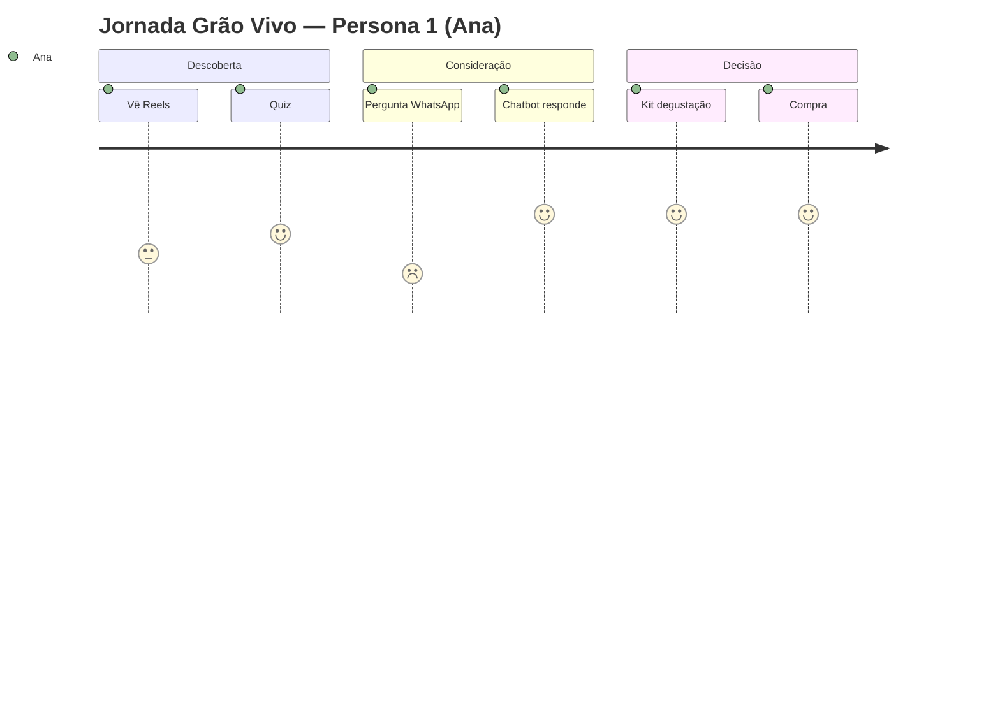
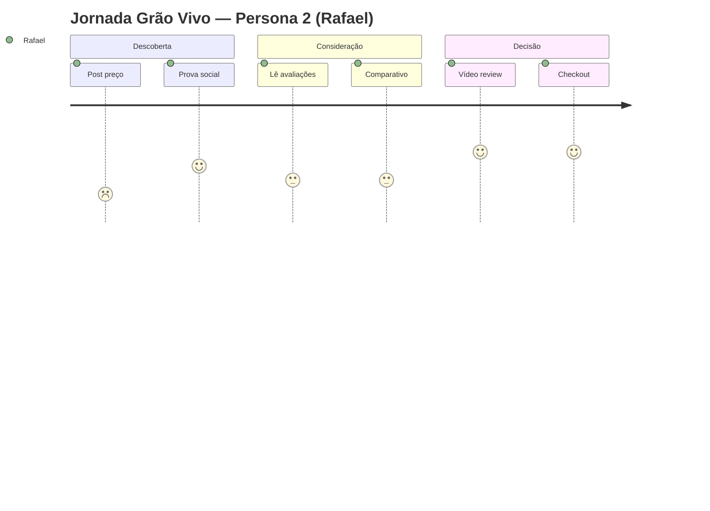

# Template — Jornada do Cliente (Descoberta → Consideração → Decisão)

> [!INFO] Como usar
> Preencha uma tabela por persona (2). Cada célula = ação + pensamento + touchpoint + oportunidade. No Obsidian, use callouts e `mermaid` para visualizar.

> [!QUOTE] Fonte — `Atividade_1_...docx:33`
> `d) mapear, para cada persona, a jornada do cliente nas etapas de descoberta, consideração e decisão;`

## Persona 1 — `[[persona#Persona 1|Nome Persona 1]]`

| Etapa | Ação da persona | Pensamento / Sentimento | Touchpoint (IG/WhatsApp/Feira) | Oportunidade de personalização | Métrica |
|---|---|---|---|---|---|
| **Descoberta** | `Vê Reels da nova torra média` | `Curiosidade: "será que combina comigo?"` | `Instagram Reels` | `Quiz “qual café combina comigo”` | `CTR Reels` |
| **Consideração** | `Manda DM perguntando diferença entre cafés` | `Dúvida: "não sei escolher"` | `WhatsApp Business` | `Chatbot com recomendação + tempo resposta <2min` | `Tempo resposta` |
| **Decisão** | `Compra kit degustação 3x50g` | `Segurança após prova` | `Loja virtual + feira sábado` | `Kit + frete grátis 1ª compra` | `Taxa conversão` |

> [!TIP] Touchpoints obrigatórios
> Inclua **IG + WhatsApp + feira** ao longo da jornada (vide [[02-perfil-grao-vivo|Quadro 2]]).

## Persona 2 — `[[persona#Persona 2|Nome Persona 2]]`

| Etapa | Ação da persona | Pensamento / Sentimento | Touchpoint | Oportunidade | Métrica |
|---|---|---|---|---|---|
| **Descoberta** | `Vê post comparativo “por que Grão Vivo vale mais”` | `Ceticismo preço: "vi parecido mais barato"` | `Instagram Carrossel` | `Conteúdo prova social (avaliações)` | `Engajamento` |
| **Consideração** | `Lê comentários e avaliações de clientes` | `Busca validação: "ninguém comentou se é bom"` | `Site / IG comentários` | `Motor recomendação “mais avaliados”` | `Tempo na página` |
| **Decisão** | `Compra torra média premium após ver vídeo` | `Confiança após prova social` | `WhatsApp + checkout` | `Cupom + prova social dinâmica` | `Conversão` |

## Visual — Mermaid Journey

## Checklist Jornada

- [ ] Cada persona tem 3 etapas preenchidas? #jornada
- [ ] Cada etapa tem touchpoint (IG/WhatsApp/Feira)? 
- [ ] Oportunidade de personalização conectada à [[proposta-personalizacao|proposta]]?
- [ ] Métrica por etapa para validar CD-a?
- [ ] Jornada resolve as 4 dores dos comentários?

> [!WARNING] Erro comum
> Deixar etapa vazia ou repetir mesma oportunidade nas 3 etapas — diferencia!

---

> [!SUCCESS] Próximo
> [[proposta-personalizacao|Proposta de Personalização]] — justifique com dados/ML.

#template #jornada
