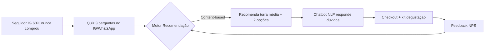

# Template — Proposta de Personalização

> [!QUOTE] Fonte — `Atividade_1_...docx:34`
> `e) propor uma ferramenta de personalização da experiência (chatbot, assistente virtual ou motor de recomendação) e justificar a escolha com base em análise de dados e aprendizado de máquina;`

> [!IMPORTANT] Critério crítico (d)
> Sem justificar com **dados + ML**, reprova. Ver [[05-entregavel-e-avaliacao#Critérios Críticos (elimina se faltar)|CC-d]].

## 1. Ferramenta Escolhida

> [!EXAMPLE] Escolha uma (ou combine) — marque
> - [ ] **Chatbot WhatsApp** (NLP) #proposta/chatbot
> - [ ] **Assistente virtual** (site/IG) #proposta/assistente
> - [ ] **Motor de recomendação** (quiz + filtragem) #proposta/recomendacao
> - [ ] **Combo** (ex: quiz → chatbot → e-mail) — para CD-c #proposta/combo

**Escolha:** `Ex: Chatbot WhatsApp com motor de recomendação acoplado (quiz “qual café combina comigo”)`

**Por que esta?** `Ex: Ataca diretamente as 2 dores centrais: “não sei qual café combina” + “demorou pra responder” — 60% nunca comprou precisa de ajuda consultiva imediata.`

## 2. Como Funciona (fluxo)

| Passo | O que acontece | Dado coletado |
|---|---|---|
| 1 | Usuário clica no quiz no IG | `Respostas: intensidade, método, frequência` |
| 2 | Motor recomenda 1–3 cafés | `Histórico + respostas` |
| 3 | Chatbot tira dúvidas em <2min | `Logs WhatsApp + intenção NLP` |
| 4 | Oferta personalizada (kit) | `Conversão` |

## 3. Justificativa com Dados e ML (obrigatória)

| Item | Detalhe | Fonte |
|---|---|---|
| **Dados de entrada** | `8.200 seguidores, 60% nunca comprou (~4.920), logs WhatsApp (tempo resposta), respostas quiz, avaliações, vendas R$45` | [[02-perfil-grao-vivo|Quadro 2]] |
| **Algoritmo / Técnica ML** | `NLP (classificação de intenção + LLM) para chatbot; filtragem baseada em conteúdo para recomendação; clustering para segmentar 2 personas` | CT2 |
| **Treino / Regra** | `Treinar chatbot com FAQs + 4 comentários reais; recomendação com matriz “preferência x atributos café”` | — |
| **Métrica de sucesso** | `Tempo resposta <2min, taxa conversão +20% (meta), CTR quiz >15%, NPS` | [[05-entregavel-e-avaliacao#CD-a|CD-a]] |
| **Validação** | `A/B test: grupo com personalização vs controle; acompanhar conversão por persona` | CD-a |

> [!TIP] Escreva 4–6 linhas corridas aqui para colar no documento final
> `Ex: Escolhi chatbot + recomendação porque 60% dos seguidores nunca comprou por falta de orientação (“não sei qual café combina”). O motor usará filtragem content-based com dados do quiz e histórico, enquanto o chatbot com NLP reduzirá o SLA de horas para minutos, impactando diretamente a dor “demorou pra responder”. O sucesso será medido por conversão +20% e tempo resposta, validado via A/B test por persona.`

## 4. MVP — O que entrega no 1º mês (meta +20%)

- [ ] Quiz 3 perguntas no IG Stories + link WhatsApp #mvp
- [ ] Chatbot com 20 intenções treinadas + fallback humano
- [ ] Motor que recomenda top 3 cafés (torra média destaque)
- [ ] Dashboard simples: conversão por persona, tempo resposta, CTR

## 5. Limitações e Próximos Passos

> [!WARNING] Para CD-c — além do mínimo
> `Ex: Fase 2: e-mail personalizado por cluster + prova social dinâmica no site (sentiment analysis nas avaliações).`

- Limitação: `Ex: precisa de volume de dados inicial; fallback humano necessário`
- Próximo passo: `Ex: integrar feira física com QR code para feedback`

## 6. Checklist Proposta

- [ ] Ferramenta é chatbot/assistente/recomendação? #proposta
- [ ] Justificativa menciona **dado + ML + métrica**? #criterio/critico
- [ ] Conecta à meta +20% e às 2 personas? #validacao
- [ ] Endereça “dificuldade de escolha” e/ou “demora WhatsApp”?

---

> [!SUCCESS] Próximo
> [[registro-prompts|Registro de Prompts]] para fechar CC-c.

#template #proposta #ml
